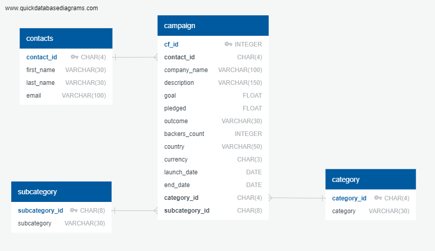

# Crowdfunding_ETL

## Overview

 In this project the Extraction-Transform-Load methodoly was utilized to process obtained raw data using. This was achieved by mainly incorporating the pandas and the regex Python programming approaches to transform and clean data to the desired format for ease of use.

## Purpose

The final goal was to store the clean data into a SQL database by first creating an ERD and it's schema and then verifying the sucessful storage of data. 

## Instructions:

The above is performed using the following steps:-

### Prerequisite:
Get started by cloning the repo to the local machine. 

Follow the below steps to run the program successfully:
1. Navigate to the main git directory Crowdfunding_ETL.
2. Open the Jupyter Notebook ETL_Mini_Project to import, process and load the processed data into csv files in the resource folder. 
3. Ensure that the input files listed below are present in the Resources directory:
    - contacts.xlsx
    - crowdfunding.xlsx

Expected output files:
1. contacts.csv
2. campaign.csv
3. category.csv
4. subcategory.csv

Once entire code in Jupyter Notebook is run, open postgres PgAdmin tool and create a new database called 'crowdfunding_db' 
Load and run the crowdfunding_db_schema.sql file to create the tables. 
Expected tables:
1. contacts
2. campaign
3. category
4. subcategory

Load csv files from the Resources directory in the following order:
1. category.csv
2. subcategory.csv
3. contacts.csv
4. campaign.csv

Load the queries from the "selecting_tables_query.sql" file and run to ensure sucessful loading of data into the tables. 
